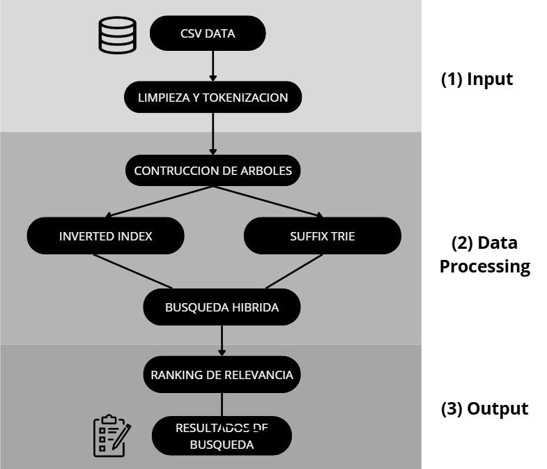

# Motor de búsqueda para plataformas de streaming

CURSO: Programación III
Enlace de repositorio de GitHub: https://github.com/ALexx-Carri/ProyectoProgaIII

---

## INTEGRANTES

| Nombre y apellido | Código |
|---|---|
| Alvaro Mallky Alagón Aguilar | 202520221 |
| Sebastian Falvy Mendoza | 202510469 |
| Omar Sotelo Cusi | 202510448 |
| Joaquim Alexander Carrión Diaz | 202510461 |
| Rodrigo Muñoz Dominguez | 202410784 |

---

## 1. Objetivo del proyecto

El proyecto tiene como objetivo desarrollar una plataforma de streaming capaz de administrar y realizar búsquedas eficientes de películas a partir de información almacenada en archivos CSV previamente limpiados.
La plataforma permitirá realizar búsquedas por palabras exactas, frases y subcadenas parciales, con el propósito de optimizar la búsqueda de información dentro de títulos y sinopsis de películas.

Para esta tarea, el sistema implementa tres estructuras de datos:

- Inverted Index: Es una estructura que almacena palabras completas y las relaciona con las películas en las que aparecen. Su función principal es permitir una búsquedas exactas de acceso rápido.

- Suffix Trie: Es un árbol que almacena todos los sufijos posibles de un texto. Esto permite realizar búsquedas parciales o por subcadenas dentro de palabras y frases. El sistema puede encontrar coincidencias incluso cuando el usuario busca solo una parte de la palabra.

- Búsqueda híbrida: Combinación entre algoritmos previamente mencionados, el Inverted Index se utiliza para localizar rápidamente películas candidatas mediante coincidencias exactas, mientras que el Suffix Trie permite verificar coincidencias parciales dentro de dichas películas sobrantes. Esta combinación reduce el tiempo de búsqueda en sistemas de grandes volúmenes de información.

---

| Estructura | Tipo de búsqueda |
|---|---|
| Inverted Index | búsqueda exacta por palabras |
| Suffix Trie | búsqueda parcial por subcadenas |
| Búsqueda Híbrida | búsqueda por frases y coincidencias complejas |

---

Además se implementa un sistema de recomendación utilizando un enfoque de Content-Based Filtering, recomendando películas según similitudes en género, palabras clave, contenido de la sinopsis, e interacciones realizadas por el usuario mediante “Like”. Asimismo, para determinar la relevancia de una película al momento de la búsqueda, el sistema asigna un puntaje acumulativo basado en los criterios ya mencionados.

## 2. Tecnologías Utilizadas

| Elemento | Tecnología |
|---|---|
| IDE utilizado | CLion |
| Lenguaje de programación | C++ 20 |
| Control de versiones | Git y GitHub |
| Librerías utilizadas | STL (Standard Template Library) |
| Formato de almacenamiento de datos | CSV |

---

## 3. Arquitectura

El sistema sigue una arquitectura modular orientada al procesamiento, almacenamiento y búsqueda eficiente de información de películas. El flujo inicia con la lectura de archivos CSV que contienen títulos, sinopsis y atributos como género, director y elenco. Posteriormente, los datos pasan por una etapa de limpieza y tokenización, donde se normalizan caracteres, se eliminan símbolos innecesarios y el texto se divide en palabras para optimizar las búsquedas. Una vez procesados los datos, el sistema construye dos estructuras principales: un Inverted Index, encargado de relacionar palabras completas con las películas donde aparecen para realizar búsquedas exactas, y un Suffix Trie, utilizado para búsquedas parciales o por subcadenas dentro de títulos y sinopsis.

Ambas estructuras son utilizadas por un motor de búsqueda híbrida que combina precisión y eficiencia. El Inverted Index permite filtrar rápidamente películas candidatas mediante coincidencias exactas, mientras que el Suffix Trie complementa el proceso verificando coincidencias parciales dentro de los resultados obtenidos. Finalmente, el sistema organiza las películas mediante un algoritmo de relevancia que prioriza coincidencias en títulos, sinopsis, tags e interacciones del usuario, mostrando como resultado las cinco películas más relevantes según la búsqueda realizada. 




## 4. Explicación de algoritmos:

Inverted Index: Es una estructura de datos que relaciona palabras con las películas en las que aparecen. Su objetivo es optimizar búsquedas exactas dentro de títulos, sinopsis y tags, permitiendo acceder rápidamente a los documentos asociados a una palabra específica. 

| En lugar de almacenar | El sistema almacena |
|---|---|
| película → palabras | palabra → películas |

a) Inserción: Durante la construcción del índice, el sistema tokenizar el texto de cada película y almacena cada palabra dentro de una tabla hash junto con su identificador


b) Búsqueda exacta: Cuando el usuario realiza una búsqueda exacta, el sistema consulta directamente el índice utilizando la palabra ingresada.


Por otro lado, la complejidad temporal de la inserción y búsqueda dentro del Inverted Index utilizan tablas hash (unordered_map), permitiendo tiempos de acceso promedio muy bajos.

| Operación | Complejidad |
|---|---|
| Inserción | O(1) |
| Búsqueda exacta | O(1) |

Suffix Trie: Es una estructura de árbol que almacena todos los sufijos posibles de un texto. Su función principal es permitir búsquedas parciales o por subcadenas dentro de palabras y frases. Gracias a esta estructura, el sistema puede encontrar coincidencias incluso cuando el usuario ingresa únicamente una parte de la palabra.

a) Inserción: Para construir el Suffix Trie, el sistema genera todos los sufijos posibles del texto e inserta cada uno carácter por carácter dentro del árbol.


b) Búsqueda parcial: Cuando el usuario realiza una búsqueda parcial, el sistema recorre el árbol carácter por carácter verificando si el patrón existe dentro de los sufijos almacenados.


La complejidad temporal de la búsqueda parcial depende únicamente de la longitud del patrón buscado, ya que el recorrido del árbol se realiza carácter por carácter.

| Operación | Complejidad |
|---|---|
| Complejidad Construcción del Trie | O(n²) |
| Búsqueda parcial | O(m) |

> *Donde n representa la longitud total del texto y m representa la longitud del patrón buscado.*

Búsqueda Híbrida: La búsqueda híbrida combina el uso del Inverted Index y el Suffix Trie para mejorar la precisión del sistema. Por un lado, el Inverted Index se encarga de reducir el universo de búsqueda seleccionando únicamente las películas que contienen palabras clave exactas de la consulta. Luego, el Suffix Trie verifica si la frase o subcadena completa realmente aparece dentro del título o sinopsis, refinando así los resultados obtenidos.


## 5. Sistema de recomendación:
El sistema de relevancia tiene como objetivo determinar qué películas son más importantes respecto a la búsqueda realizada por el usuario. Para ello, el sistema asigna un puntaje acumulativo según el tipo de coincidencia encontrada dentro de la información.

### Tabla de criterio de puntaje:

| Criterio | Puntaje |
|---|---|
| Coincidencia exacta en el título | +50 |
| Coincidencia parcial en el título | +40 |
| Coincidencia exacta en la sinopsis | +30 |
| Coincidencia parcial en la sinopsis | +20 |
| Coincidencia en género | +20 |
| Coincidencia en director o cast | +10 |
| Película marcada con “Like” por el usuario | +30 |

Una vez calculado el puntaje de relevancia de cada película, el sistema ordena los resultados de mayor a menor según la coincidencia obtenida. Posteriormente, se muestran las cinco películas más relevantes para la búsqueda realizada, permitiendo además visualizar resultados adicionales mediante un sistema de paginación.

## 6. Clases y estructuras del programa:

### Movie
La clase `Movie` representa la información principal de cada película almacenada dentro del sistema. Contiene atributos correspondientes a los datos obtenidos desde el archivo CSV.

```cpp
class Movie {
private:
    int id;
    int releaseYear;
    string title;
    string originEthnicity;
    string director;
    vector<string> cast;
    vector<string> genres;
    string wikiPage;
    string plot;

public:
    int getId();
    string getTitle();
    string getPlot();
};
```
---


### CSVReader
La clase `CSVReader` tiene como función leer los archivos CSV y convertir cada fila en objetos de tipo `Movie`.

```cpp
class CSVReader {
public:
    vector<Movie> loadCSV(string filePath);
};
```
---

### DataCleaner
La clase `DataCleaner` se encarga de limpiar y normalizar los datos obtenidos desde el CSV, eliminando caracteres innecesarios, corrigiendo formatos y estandarizando el texto antes de construir las estructuras de búsqueda.

```cpp
class DataCleaner {
public:
    vector<Movie> cleanData(vector<Movie> movies);
};
```

---

### Tokenizer
La clase `Tokenizer` divide títulos y sinopsis en palabras individuales para facilitar la construcción del índice invertido y las búsquedas.

```cpp
class Tokenizer {
public:
    vector<string> tokenize(string text);
};
```

---

### InvertedIndex
La clase `InvertedIndex` almacena la relación entre palabras y películas. Permite realizar búsquedas exactas de manera eficiente mediante acceso rápido a los documentos asociados a cada palabra.

```cpp
class InvertedIndex {
private:
    unordered_map<string, vector<int>> index;

public:
    void insertWord(string word, int movieId);
    vector<int> searchWord(string word);
};
```

---

### SuffixNode
La estructura `SuffixNode` representa un nodo dentro del `Suffix Trie`. Cada nodo almacena conexiones hacia los siguientes caracteres posibles dentro de los sufijos del texto.

```cpp
struct SuffixNode {
    unordered_map<char, SuffixNode*> children;
    bool isEnd;
};
```

---

### SuffixTrie

La clase `SuffixTrie` administra la construcción y recorrido del Trie de sufijos. Su objetivo es permitir búsquedas parciales y coincidencias internas dentro de palabras y frases.

```cpp
class SuffixTrie {
private:
    SuffixNode* root;

public:
    void insertSuffix(string suffix);
    bool searchSubstring(string pattern);
};
```

---

### RankingSystem
La clase `RankingSystem` calcula la relevancia de las películas encontradas durante la búsqueda. El puntaje se obtiene según coincidencias en títulos, sinopsis, tags e interacciones del usuario.

```cpp
class RankingSystem {
public:
    vector<Movie> rankMovies(
        vector<Movie> movies,
        string query
    );
};
```

---

### RecommendationSystem
La clase `RecommendationSystem` implementa un sistema de recomendación basado en `Content-Based Filtering`, sugiriendo películas similares según género, palabras clave, contenido de la sinopsis e interacciones realizadas por el usuario.

```cpp
class RecommendationSystem {
public:
    vector<Movie> recommendMovies(
        vector<Movie> likedMovies,
        vector<Movie> allMovies
    );
};
```

---

### SearchEngine
La clase `SearchEngine` actúa como el motor principal de búsqueda del sistema. Se encarga de coordinar el uso del `Inverted Index` y el `Suffix Trie` para realizar búsquedas híbridas y devolver resultados relevantes al usuario.

```cpp
class SearchEngine {
private:
    InvertedIndex invertedIndex;
    unordered_map<int, SuffixTrie> suffixTries;
    RankingSystem rankingSystem;

public:
    vector<Movie> search(string query);
    vector<Movie> searchByTag(string tag);
};
```

## 7. Pseudocódigos del programa

---

### Limpieza de datos
Este proceso limpia la información obtenida desde los archivos CSV para garantizar búsquedas consistentes y evitar errores producidos por datos incompletos. Se enfoca en la eliminación de datos duplicados, el tratamiento de valores nulos y faltantes, la estandarización de formatos y la corrección de problemas de encoding.

```text
ALGORITMO LimpiarDatos

ENTRADA: archivoCSV
SALIDA: peliculasLimpias

INICIO

    Lectura del archivoCSV

    PARA CADA fila EN archivoCSV HACER

        Eliminar registros duplicados
        Reemplazar valores nulos o vacíos
        Convertir texto a minúsculas
        Eliminar caracteres especiales
        Corregir problemas de comillas y encoding
        Estandarizar formatos de texto
        Crear objeto Movie
        Agregar Movie a peliculasLimpias

    FIN PARA

    RETORNAR peliculasLimpias

FIN
```

---

#
### Tokenización
La tokenización divide el texto en palabras individuales que posteriormente serán utilizadas durante la construcción del índice y las búsquedas.

```text
ALGORITMO Tokenizar

ENTRADA: texto
SALIDA: listaPalabras

INICIO

    Eliminar signos de puntuación
    Separar texto por espacios
    Guardar palabras en listaPalabras

    RETORNAR listaPalabras

FIN
```

---

### Construcción del Inverted Index
Es un estructura que permite relacionar cada palabra con las películas donde aparece, optimizando las búsquedas exactas.

```text
ALGORITMO ConstruirIndiceInvertido

ENTRADA: palabras, indice, document_id
SALIDA: indiceActualizado

INICIO

    PARA CADA palabra EN palabras HACER

        SI palabra NO EXISTE EN indice ENTONCES
            indice[palabra] ← lista vacía
        FIN SI

        SI document_id NO EXISTE EN indice[palabra] ENTONCES
            insertar document_id EN indice[palabra]
        FIN SI

    FIN PARA

    RETORNAR indiceActualizado

FIN
```

---

### Construcción del Suffix Trie
Es un árbol que almacena sufijos de texto para permitir búsquedas parciales o coincidencias por subcadenas.

```text
ALGORITMO ConstruirSuffixTrie

ENTRADA: texto
SALIDA: trie

INICIO

    Crear trie vacío

    PARA i ← 0 HASTA longitud(texto)-1 HACER

        sufijo ← subcadena(texto, i)

        InsertarSufijo(
            trie.raiz,
            sufijo
        )

    FIN PARA

    RETORNAR trie

FIN
```

---

### Inserción de Sufijos
Este algoritmo inserta cada sufijo dentro del Suffix Trie recorriendo el árbol carácter por carácter desde el nodo padre hacia sus nodos hijos. Si un nodo hijo no existe, se crea uno nuevo, permitiendo almacenar todos los posibles sufijos del texto.

```text
ALGORITMO InsertarSufijo

ENTRADA: nodo, sufijo
SALIDA: trieActualizado

INICIO

    actual ← nodo

    PARA CADA caracter EN sufijo HACER

        SI caracter NO EXISTE EN actual.hijos ENTONCES
            actual.hijos[caracter] ← nuevo Nodo
        FIN SI

        actual ← actual.hijos[caracter]

    FIN PARA

    actual.fin ← VERDADERO

    RETORNAR trieActualizado

FIN
```

---

### Búsqueda Exacta
La búsqueda exacta utiliza el Inverted Index para localizar películas mediante palabras completas.

```text
ALGORITMO BuscarPalabra

ENTRADA: indice, palabra
SALIDA: resultados

INICIO

    SI palabra EXISTE EN indice ENTONCES
        RETORNAR indice[palabra]
    FIN SI

    RETORNAR vacío

FIN
```

---

### Búsqueda Parcial
La búsqueda parcial verifica coincidencias internas dentro de palabras o frases utilizando el Suffix Trie.

```text
ALGORITMO BuscarSubstring

ENTRADA: arbolesSufijos, patron
SALIDA: resultados

INICIO

    resultados ← lista vacía

    PARA CADA doc_id EN arbolesSufijos HACER

        arbol ← arbolesSufijos[doc_id]

        SI ExistePatron(
            arbol.raiz,
            patron
        ) ENTONCES
            insertar doc_id EN resultados
        FIN SI

    FIN PARA

    RETORNAR resultados

FIN
```

---

### Verificación de patrones
Este algoritmo recorre el Suffix Trie para comprobar si un patrón existe dentro del texto almacenado.

```text
ALGORITMO ExistePatron

ENTRADA: nodo, patron
SALIDA: booleano

INICIO

    actual ← nodo

    PARA CADA caracter EN patron HACER

        SI caracter NO EXISTE EN actual.hijos ENTONCES
            RETORNAR FALSO
        FIN SI

        actual ← actual.hijos[caracter]

    FIN PARA

    RETORNAR VERDADERO

FIN
```

---

### Búsqueda Híbrida
La búsqueda híbrida combina el Inverted Index y el Suffix Trie para mejorar la precisión durante búsquedas de palabras, frases y subcadenas dentro de títulos y sinopsis.

```text
ALGORITMO BuscarHibrida

ENTRADA: indice, arbolesSufijos, consulta
SALIDA: resultados

INICIO

    palabras ← Tokenizar(consulta)

    candidatos ← BuscarPalabra(
        indice,
        palabras[0]
    )

    resultados ← lista vacía

    PARA CADA doc_id EN candidatos HACER

        arbol ← arbolesSufijos[doc_id]

        SI ExistePatron(
            arbol.raiz,
            consulta
        ) ENTONCES
            insertar doc_id EN resultados
        FIN SI

    FIN PARA

    RETORNAR resultados

FIN
```

---

### Búsqueda por tags
Este algoritmo permite buscar películas mediante atributos como género, director o elenco.

```text
ALGORITMO BuscarPorTag

ENTRADA: indiceTags, tag
SALIDA: resultados

INICIO

    SI tag EXISTE EN indiceTags ENTONCES
        RETORNAR indiceTags[tag]
    FIN SI

    RETORNAR vacío

FIN
```

---

### Sistema de Relevancia
El sistema de relevancia calcula un puntaje para determinar qué películas son más importantes respecto a la búsqueda realizada.

```text
ALGORITMO CalcularRelevancia

ENTRADA: peliculas, consulta
SALIDA: ranking

INICIO

    PARA CADA pelicula EN peliculas HACER

        puntaje ← 0

        SI consulta EXISTE EN pelicula.title ENTONCES
            puntaje ← puntaje + 5
        FIN SI

        SI consulta EXISTE EN pelicula.plot ENTONCES
            puntaje ← puntaje + 3
        FIN SI

        SI consulta EXISTE EN tags ENTONCES
            puntaje ← puntaje + 2
        FIN SI

        Guardar puntaje de pelicula

    FIN PARA

    Ordenar peliculas por puntaje descendente

    RETORNAR primeras 5 peliculas

FIN
```

---

### Sistema de Recomendación
El sistema de recomendación utiliza Content-Based Filtering para sugerir películas similares según gustos e interacciones del usuario.

```text
ALGORITMO RecomendarPeliculas

ENTRADA: likesUsuario, peliculas
SALIDA: recomendaciones

INICIO

    recomendaciones ← lista vacía

    PARA CADA peliculaLike EN likesUsuario HACER

        PARA CADA pelicula EN peliculas HACER

            SI genero SIMILAR O
               palabrasClave SIMILARES O
               sinopsis SIMILAR ENTONCES

                agregar pelicula A recomendaciones

            FIN SI

        FIN PARA

    FIN PARA

    Ordenar recomendaciones por similitud

    RETORNAR recomendaciones

FIN
```

---

### Construcción General del Sistema
El sistema integra todas las estructuras necesarias para permitir búsquedas y recomendaciones eficientes.

```text
ALGORITMO ConstruirSistema

ENTRADA: likesUsuario, peliculas
SALIDA: recomendaciones

INICIO

    Crear indiceInvertido vacío
    Crear arbolesSufijos vacío

    PARA CADA pelicula EN peliculas HACER

        texto ← pelicula.title + pelicula.plot

        palabras ← Tokenizar(texto)

        ConstruirIndiceInvertido(
            indiceInvertido,
            palabras,
            pelicula.id
        )

        arbol ← ConstruirSuffixTrie(texto)

        arbolesSufijos[pelicula.id] ← arbol

    FIN PARA

FIN
```
